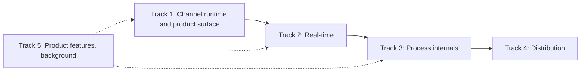

# Project: BeamSlack — Learn Elixir, OTP, and the BEAM by Building a Slack-Like Application

## Goal

Build a Slack-like collaboration platform using Elixir, Phoenix, Ecto, PostgreSQL,
React, and TypeScript.

The primary objective is not simply to build a working product. The primary
objective is to deeply understand the Erlang/Elixir ecosystem and the concepts
that make the BEAM unique:

* lightweight processes
* message passing
* process isolation
* GenServer
* Supervisor
* DynamicSupervisor
* Registry
* process links
* process monitors
* supervision trees
* restart strategies
* "let it crash"
* ephemeral vs durable state
* Phoenix Channels
* Phoenix PubSub
* Phoenix Presence
* ETS
* background jobs
* distributed Erlang nodes
* fault tolerance
* failure recovery

The learner has previous professional Elixir experience but has not had enough
opportunity to deeply explore OTP and BEAM architecture. This project prioritizes
those concepts.

---

# How We Work

This document originally split the project into 28 sequential phases, each gated
behind a nine-step Socratic dialogue. That protocol was the bottleneck: the
learner spent most of the calendar time waiting for conversational turns rather
than writing OTP code, and the product surface stayed too thin to exercise the
interesting runtime behavior.

The roadmap is now organized as **five tracks**. Each track pairs an autonomous
Codex build batch (the product surface, plumbing, and test harnesses) with a
small number of concentrated **labs** that the learner owns outright.

## Codex builds autonomously

Codex does not stop to ask permission for any of the following, and should batch
this work as large as is practical:

* Phoenix and React scaffolding, TypeScript config, CSS, UI components, forms
* REST controllers, JSON views, routers, request tests
* authentication boilerplate
* Ecto schemas, migrations, changesets, repetitive context functions
* GraphQL/Absinthe schema boilerplate
* socket and channel *plumbing* (`UserSocket`, `socket/3` in the endpoint,
  adding `Phoenix.PubSub` to the supervision tree, module skeletons)
* frontend state handling, API clients, WebSocket client wiring
* Docker and PostgreSQL development configuration
* seeds, fixtures, utility functions, repetitive tests
* observability setup (Telemetry, LiveDashboard, structured logging)
* fault-injection tooling, load-test harnesses, multi-node dev scripts

Anything that is repetitive, mechanical, or has one obvious correct shape belongs
to Codex. The learner should not spend learning time on it.

## The learner owns the labs

The following remain the learner's to design and implement:

* raw processes, message passing, and recursive receive loops
* GenServer callback design and state ownership
* Supervisor and DynamicSupervisor topology, restart strategies, child specs
* Registry-based process discovery and the races around it
* process lifecycle: when a process should start, and who decides it stops
* process monitoring and linking
* ETS ownership and lifetime
* PubSub topic architecture and fan-out decisions
* Presence architecture
* timer-driven state machines
* failure boundaries and fault recovery design
* distributed node behavior and cross-node process discovery
* backpressure and process design under load

## The lab protocol

Codex replaces the old nine-step dialogue with two written artifacts, delivered
up front so the learner is never blocked waiting on a reply.

1. **A design brief** at `docs/labs/NN-name.md` containing: the problem, the
   constraints, the realistic options with their tradeoffs, the failure questions
   to answer, and explicit acceptance criteria. The brief poses the questions and
   lays out the design space. It does **not** contain the answer, and it does not
   contain implementation code.
2. **Failing tests as the specification.** Codex writes the test file, plus the
   target module's `@moduledoc` and `@spec`s, and nothing else. The learner writes
   the implementation. `mix test` is the definition of done, so the learner gets
   immediate feedback without waiting for a review turn.

Rules that still hold absolutely:

* Codex never writes the body of a function assigned to a lab.
* Codex never silently replaces, refactors, or "cleans up" the learner's
  implementation. If it looks wrong, say so and ask.
* Codex may review on request, and may point out a bug it notices, but does not
  hand over a full solution unless the learner explicitly asks for one.
* If a Codex build batch needs a lab module that does not exist yet, Codex stubs
  the call site and moves on rather than implementing the lab.

---

# Project Concept

The application is called **BeamSlack**. It is a simplified Slack-like
collaboration application.

Users belong to workspaces. A workspace contains channels. Users can join
workspaces, join channels, send messages, reply in threads, see online users, see
typing indicators, react to messages, receive notifications, and search message
history.

The architecture should evolve gradually. Do not introduce unnecessary
infrastructure early. Avoid Redis, Kafka, RabbitMQ, Kubernetes, and microservices
unless a later problem clearly justifies them. Prefer learning what OTP and the
BEAM provide first.

---

# State Classification

Whenever implementing a feature, explicitly classify its state.

## Durable state

State that must survive process, application, and node crashes: users,
workspaces, channels, memberships, messages, threads, reactions, file metadata,
notification history. Normally PostgreSQL or durable object storage.

## Ephemeral state

State that may disappear and be reconstructed: online presence, active socket
connections, typing indicators, temporary process state, caches. Candidates are
Elixir process state, Phoenix Presence, and ETS.

## Recoverable operational state

An operation that should survive worker failure: image processing, email and push
notifications, file processing, search indexing. Candidates are Oban, persisted
job state, retries, and idempotency keys.

Always discuss which category a new feature belongs to.

---

# Current Status

Complete:

* **Project setup.** Phoenix + Ecto + PostgreSQL backend, React + TypeScript
  frontend, Docker Postgres, `GET /api/health` and a frontend health screen.
* **Slack domain model.** `Accounts`, `Workspaces`, `Channels`, and `Messaging`
  contexts with UUID primary keys, migrations, changesets, and context tests.
  Everything synchronous, no real-time behavior.
* **Learner labs on raw processes, GenServer, Supervisor, and DynamicSupervisor.**
  Implemented in `backend/lib/beamslack/experiments/`. These are standalone
  experiments, not yet part of the supervision tree; Track 1 promotes them into
  the running application.

The supervision tree is still `[BeamSlack.Repo, BeamSlackWeb.Endpoint]`. There is
no HTTP surface beyond the health endpoint, and no Channels, PubSub, or Presence.

---

# Track Structure



Tracks 1 through 4 run in order, because each depends on the runtime surface the
previous one established. Track 5 is product work with almost no BEAM content, so
Codex runs it in the background between labs rather than as a sequential gate.

Ordering rationale: real-time, process internals, and distribution carry nearly
all of the remaining BEAM learning value. GraphQL, file uploads, and search teach
very little about the BEAM, so they are deferred to an optional tail.

---

## Track 1 — Channel Runtime and the Product Surface

The goal is a usable application, so that later tracks have somewhere real to
observe process behavior, plus the learner's first process-discovery lab.

### Codex builds

* Token-based authentication over the existing `bcrypt_elixir` setup
* REST controllers, JSON views, and request tests for users, workspaces,
  channels, and messages
* A real `priv/repo/seeds.exs` with a sample workspace, users, channels, and
  message history
* React app shell: routing, a typed API client, login, workspace sidebar, channel
  list, message pane, and composer

### Lab 01 — Channel runtime discovery and lifecycle

The learner designs and implements `BeamSlack.Runtime.ChannelRuntime` so callers
never hold PIDs:

```elixir
ChannelRuntime.get_or_start(channel_id)
```

Covering:

* `Registry` registration and the `:via` tuple
* the concurrent-start race: request A and request B both ask for channel 10 at
  the same time, both see no process, and what
  `DynamicSupervisor.start_child/2` returning `{:error, {:already_started, pid}}`
  means for the public API
* when a runtime process should exist at all — not every channel row should have
  one; consider inactive channels and millions of channels
* idle shutdown, and who decides that a process stops
* promoting `experiments/` into a supervised `BeamSlack.Runtime` namespace in
  `application.ex`, choosing and justifying the restart strategy

### Checkpoint — supervision tree

The learner should be able to explain, without assistance:

1. What happens when one channel runtime crashes?
2. What happens if the DynamicSupervisor crashes?
3. What happens if the Registry crashes?
4. What happens if the entire BEAM node crashes?
5. Which state survives each failure?

Core lesson: **supervisors restore processes, not memory.**

---

## Track 2 — Real-time

Slack messaging over Phoenix Channels, plus presence and typing indicators.

### Codex builds

* `UserSocket` and the `socket/3` plug in the endpoint
* `Phoenix.PubSub` in the supervision tree
* A `ChannelChannel` skeleton with `join/3` and `handle_in/3` stubs
* `BeamSlackWeb.Presence` boilerplate
* The `phoenix` JS client with typed React hooks
* Live message list, presence list, and typing indicator UI

### Lab 02 — Persist vs broadcast ordering

Should a message be broadcast before or after it is persisted? Analyze database
failure, process crash, duplicate sends, and client reconnect. Then implement the
chosen ordering, and decide where the event is emitted from.

### Lab 03 — PubSub topic architecture

Design the topic taxonomy and decide which process subscribes to what: the socket
process, the channel runtime, or both. Teach the distinction between direct
process messages, GenServer calls, Phoenix Channels, and Phoenix PubSub. Consider
future subscribers (notifications, analytics, audit logging) without introducing
unnecessary abstraction.

### Lab 04 — Presence architecture

Decide whether presence lives in `Phoenix.Presence`, in the channel runtime's own
state, or both, and why PostgreSQL should not be its source of truth. Compare
process state, ETS, Presence, and the database.

One user may have several presences (desktop, browser, mobile). Verify: open two
tabs, user appears online; close one tab, user stays online; close the second,
user goes offline.

### Lab 05 — Typing indicators as a timer state machine

Deliberately ephemeral, never persisted. The learner hand-writes the expiry logic
with `Process.send_after/3`, per-user timer references held in process state, and
timer cancellation on each new keystroke:

```
typing_started -> no further events for N seconds -> typing expired
```

---

## Track 3 — Process Internals

Deliberately break things and watch what the BEAM does about it. This is the most
important track in the project.

### Codex builds

* Dev-only fault injection: endpoints and mix tasks to kill named processes,
  crash a channel runtime, and drop the Repo connection
* `phoenix_live_dashboard`, Telemetry, and structured logging
* A harness that floods one process faster than it can drain its mailbox
* A load-test mix task that opens N concurrent WebSocket clients and simulates
  joins, presence, messages, typing, and reconnects

### Lab 06 — Monitors and links

`Process.monitor/1`: A monitors B, B is killed, observe `:DOWN`. Then compare with
links and trapped exits. Discuss when failure should *propagate* versus when it
should merely be *observed*.

### Lab 07 — ETS ownership

Pick a legitimate use case (rate-limit counters, hot workspace metadata cache).
Create the table, insert, read from several processes, kill the owner, observe
what happens. Cover `public`/`protected`/`private`, memory lifetime, and the
`heir` option. Never store permanent messages in ETS.

### Lab 08 — Backpressure

Run the flood harness, watch mailbox growth in LiveDashboard, then fix it.
Discuss bottlenecks, backpressure strategies, and process design.

### Lab 09 — Failure matrix

For every injected fault, answer: What died? What survived? What restarted? What
data disappeared? What data remained? Who performed recovery? Is the behavior
acceptable?

---

## Track 4 — Distribution

The goal is to understand that BEAM distribution does not eliminate
distributed-systems problems.

### Codex builds

* Two-node dev scripts with distinct short names, cookies, and HTTP ports
* A way to point separate browser sessions at each node

No Kubernetes, and nothing that hides the topology. The learner should be able to
describe the node layout from memory.

### Lab 10 — Node connection and cross-node discovery

Manual `Node.connect/1` and `Node.list/0`, then the central problem: a `Registry`
is node-local, so `ChannelRuntime.get_or_start/1` will happily start a second
process for the same channel on a second node. Evaluate `:global`, `:pg`, and
Horde-style approaches conceptually, and decide what BeamSlack should do.

### Lab 11 — Kill a node

User A on node A, user B on node B. Kill node A and observe A's WebSocket, both
nodes' processes, Presence, the messages in PostgreSQL, and reconnection. Then
attribute each recovery mechanism to OTP, Phoenix, client reconnect logic, or
PostgreSQL, without conflating them.

### Lab 12 — Network partitions

Simulate node A losing sight of node B. Explore stale presence, divergent
distributed state, and split brain. Discuss CAP conceptually. The goal is not to
build Raft.

---

## Track 5 — Product Features (background)

Codex builds these end to end while the learner works on labs. Almost no BEAM
content, so they are not a gate on anything.

* **Threads.** `parent_message_id` on messages, thread retrieval, thread
  broadcasts. Thread messages are durable; thread-viewer presence is ephemeral;
  keep the two separate.
* **Reactions.** Persisted, real-time via PubSub, unique on
  `user + message + emoji`. Idempotent by construction.
* **Mentions.** `@user` and `@channel`: persist the message, detect mentions,
  emit notification events.
* **Notifications.** In-app first, email later.

### Lab 13 — Notification failure boundaries

The one learner-owned piece here. Sending a Slack message must not fail because
the email provider is down. Decide what is synchronous and what is asynchronous,
and classify each notification path across `Task`, a supervised `Task`, and a
durable Oban job by asking: what happens if the BEAM node dies halfway through
this operation?

---

## Optional Tail

Only if wanted after Track 4, in roughly this order:

* **GraphQL with Absinthe.** Queries and mutations over the existing contexts.
  Codex generates the schema; the learner reviews resolvers, context, and
  authorization.
* **The N+1 problem.** Deliberately write `workspace -> channels -> messages ->
  authors`, observe the SQL, then introduce Dataloader and batching. Do not solve
  it before demonstrating it.
* **GraphQL subscriptions.** Implement exactly one feature this way and compare
  against Phoenix Channels. Do not blindly replace Channels.
* **File uploads.** Signed-URL flow with `pending`/`completed`/`failed` metadata
  states, and idempotent completion. Do not route large files through a
  long-lived GenServer.
* **Background jobs with Oban.** Thumbnails, emails, file processing.
* **Search.** PostgreSQL full-text first. Only consider dedicated search
  infrastructure if PostgreSQL's limits become a real learning problem.
* **Direct messages, group DMs, message editing and deletion, pinned messages,
  scheduled messages, reminders, bots, slash commands, an AI channel assistant,
  and webhooks.**

---

# Final Learning Review

At the end, the learner explains BeamSlack entirely without assistance.

**Processes.** What is a BEAM process? What is its mailbox? Why is state
immutable? What happens when a process crashes?

**OTP.** GenServer, Supervisor, DynamicSupervisor, Registry, links, monitors.

**Failure.** Channel runtime crash, WebSocket process crash, background worker
crash, database failure, complete node crash.

**State.** Which state belongs in PostgreSQL, process memory, ETS, Phoenix
Presence, object storage, and Oban.

**Real-time.** Phoenix Channels, PubSub, Presence.

**Distributed systems.** Multiple BEAM nodes, node failure, client reconnect,
network partitions.

---

# Core Principle

Throughout development, repeatedly ask:

> What happens if this process dies right now?

Then:

> What happens if the entire node dies right now?

Then:

> What information do we actually need to recover?

The goal is to stop thinking only in terms of objects and services and start
thinking in terms of isolated processes, state ownership, message passing, failure
boundaries, supervision, and recovery.

---

# Appendix: Phase-to-Track Mapping

For continuity with the original 28-phase plan.

| Original phases | Now |
| --- | --- |
| 0 (setup), 1 (domain model) | Complete |
| 2–5 (raw processes, GenServer, Supervisor, DynamicSupervisor) | Complete, in `experiments/` |
| 6 (Registry) | Track 1, Lab 01 |
| 7–10 (Channels, PubSub, Presence, typing) | Track 2, Labs 02–05 |
| 15–17, 27–28 (monitoring, ETS, fault injection, observability, load testing) | Track 3, Labs 06–09 |
| 24–26 (multi-node, node kill, partitions) | Track 4, Labs 10–12 |
| 11–14 (threads, reactions, mentions, notifications) | Track 5, Lab 13 |
| 18–23 (GraphQL, N+1, subscriptions, uploads, Oban, search) | Optional tail |
